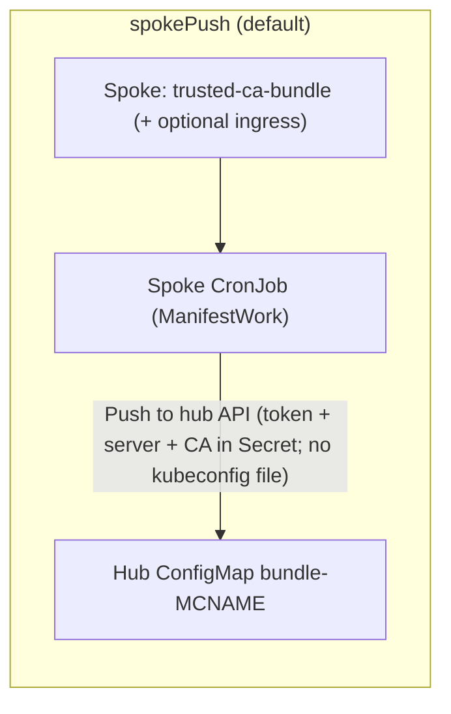
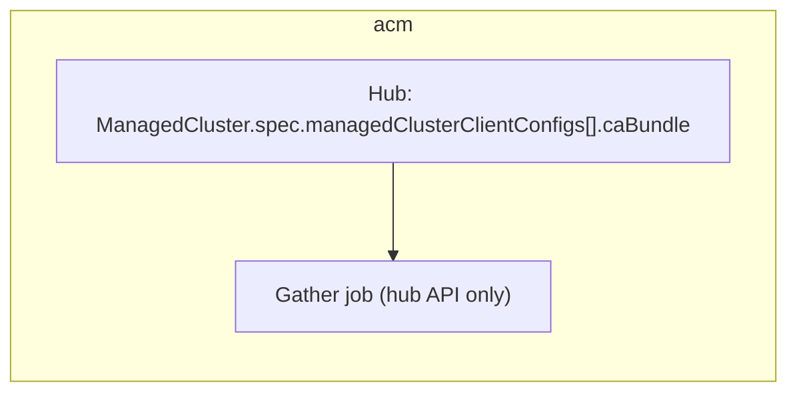
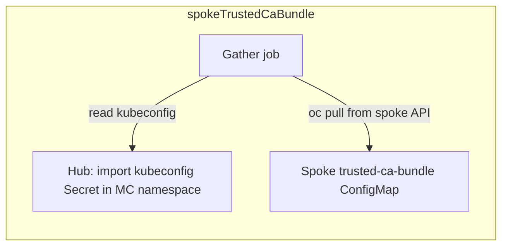
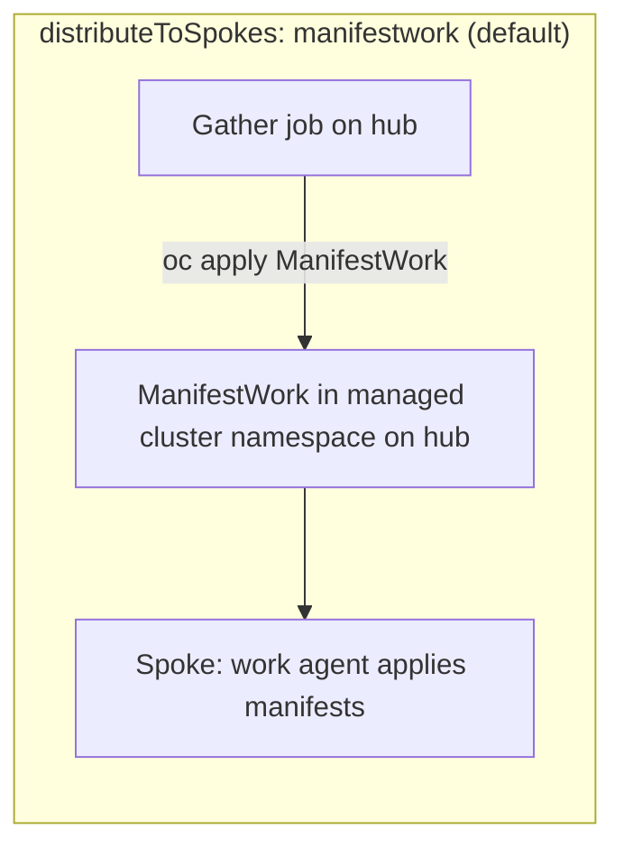
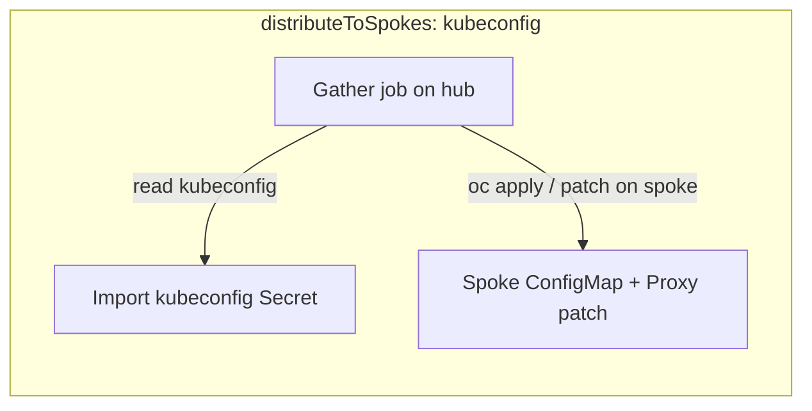
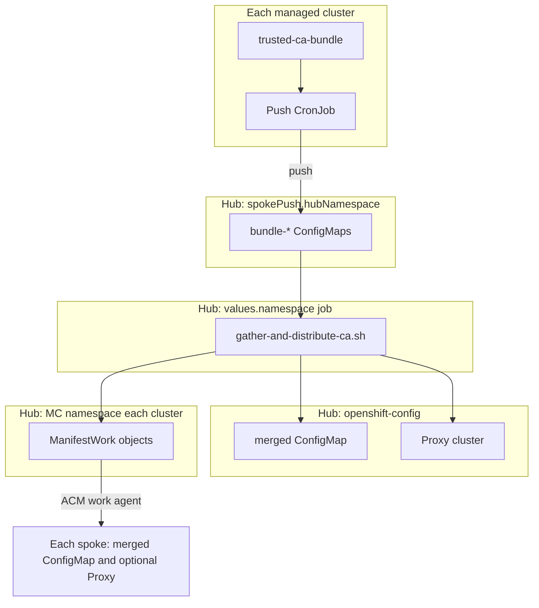

# vp-manage-proxy-cluster-ca

 

Hub-side chart for OpenShift with ACM. Aggregates trusted CA PEMs from the hub and managed clusters (default: spoke push + hub ingress), de-duplicates them, materializes a cluster-wide ConfigMap for Proxy trustedCA, and applies the same bundle to spokes via ManifestWork. ACM Policy + PlacementBinding are enabled by default to enforce Proxy trustedCA on the Placement's clusters; override policy.placementRef to an existing Placement or disable policy.enabled until one exists.

## Overview

Helm chart for the **hub** cluster (OpenShift + ACM). It periodically aggregates PEM material from:

- the hub: `ConfigMap/openshift-config-managed/trusted-ca-bundle` (`ca-bundle.crt`), and optionally the ingress `router-ca` secret;
- each selected **ManagedCluster**:
  - **`managedClusterCaSource: spokePush`** (default): a **ManifestWork** deploys a CronJob on each spoke that reads `trusted-ca-bundle` (and optional ingress CA) and **writes** `ConfigMap/bundle-<cluster>` into **`spokePush.hubNamespace`** on the hub using a short-lived **hub token** plus **API URL** and **CA PEM** in a Secret (**no kubeconfig file**; spokes use `oc --server` / `--token` / `--certificate-authority`). The gather job mints credentials and **reads every** `bundle-*` ConfigMap in that namespace (nothing in your Git repository).
  - **`acm`**: `ManagedCluster.spec.managedClusterClientConfigs[].caBundle` on the hub (API trust only; does not mirror each spoke’s full `trusted-ca-bundle`).
  - **`spokeTrustedCaBundle`**: full spoke `openshift-config-managed/trusted-ca-bundle` via ACM import kubeconfig ([opp-policy-chart](https://github.com/validatedpatterns/opp-policy-chart)-style).

Certificates are **split and de-duplicated** by SHA-256 certificate fingerprint, then written to a single `ConfigMap` (`ca-bundle.crt`) in `openshift-config`. On the hub the job applies the ConfigMap and patches **`Proxy/cluster`**. On spokes (defaults) it applies **`ManifestWork`** objects in each managed cluster namespace so the **work agent** applies the same ConfigMap (and optionally a second ManifestWork for `Proxy` `trustedCA`) — still **no kubeconfig** in the chart or job for rollout. Set `distributeToSpokes: kubeconfig` to push via import secrets instead.

Optional **`additionalCaBundles`** in `values.yaml` are merged before de-duplication (see `values.yaml` for Vault-on-hub vs off-hub notes and a commented PEM example). ACM **Policy** + **PlacementBinding** are **on by default** (`policy.enabled`) to enforce `Proxy` `trustedCA`; ensure `policy.placementRef.name` names an existing **Placement** (default `vp-proxy-ca`) or override it. Set `policy.enabled: false` or align `manifestWork.patchClusterProxy` with your governance if Policy alone should own Proxy.

Defaults (**`spokePush`** + **`manifestwork`** + **`manifestWork.patchClusterProxy: true`**) avoid **kubeconfig files** in Git or in the gather pod for rollout; **`spokeTrustedCaBundle`** or **`distributeToSpokes: kubeconfig`** still read ACM import **kubeconfig Secrets on the hub** at runtime.

## Push and pull configuration options

Configuration splits into two **independent** axes:

1. **`managedClusterCaSource`** — how the hub **gather job** obtains per-cluster trust material before merge/de-duplication.
2. **`distributeToSpokes`** — how the merged bundle (and optional `Proxy` patch) is **applied on each spoke** after the hub updates its own `ConfigMap`/`Proxy`.

The hub always reads **hub-local** `openshift-config-managed/trusted-ca-bundle` (and optional ingress) with in-cluster credentials. `includeIngressCA` applies on the hub always; on spokes it is honored for **`spokePush`** (push script) and **`spokeTrustedCaBundle`** (pull via kubeconfig), but **not** for **`acm`** (the script skips spoke ingress in that mode).

### How each `managedClusterCaSource` works







### How each `distributeToSpokes` mode works

After the merge, the job updates the hub, then for every selected `ManagedCluster`:





### End-to-end: recommended default

Hub gather periodically merges sources, writes `configMapName` in `targetNamespace`, patches hub `Proxy`, then rolls out to spokes **without** storing kubeconfigs in the chart or Git:



### Combination matrix

| `managedClusterCaSource` | Spoke trust material | Hub gather uses import kubeconfig? | Notes |
|-------------------------|----------------------|-----------------------------------|--------|
| **`spokePush`** | Full platform bundle (+ optional ingress) pushed into **`spokePush.hubNamespace`** | **No** (reads `bundle-*` on hub) | Spokes use short-lived hub token + API URL + hub CA in a Secret; **`spokePush.hubApiServer`** if spokes cannot use the gather pod’s API URL. |
| **`acm`** | API client CA only from **`ManagedCluster`** CR | **No** | Does not mirror each spoke’s full `trusted-ca-bundle`; **`includeIngressCA`** does not add per-spoke ingress CAs. |
| **`spokeTrustedCaBundle`** | Full `trusted-ca-bundle` (+ optional ingress) pulled from each spoke | **Yes** | Same import Secret pattern as [opp-policy-chart](https://github.com/validatedpatterns/opp-policy-chart). |

| `distributeToSpokes` | Rollout mechanism | Hub job uses import kubeconfig? |
|------------------------|-------------------|--------------------------------|
| **`manifestwork`** | `ManifestWork` in each managed-cluster namespace; work agent applies | **No** |
| **`kubeconfig`** | `oc` against each spoke API using import kubeconfig | **Yes** |

So **kubeconfig on the hub** is required when **either** axis is set to the kubeconfig/import path: `managedClusterCaSource: spokeTrustedCaBundle` **or** `distributeToSpokes: kubeconfig` (or both).

### Values examples

**Default (no kubeconfig for gather or rollout):** push bundles from spokes, distribute with `ManifestWork`.

```yaml
managedClusterCaSource: spokePush
distributeToSpokes: manifestwork
spokePush:
  hubNamespace: vp-proxy-ca-bundles
  spokeNamespace: vp-proxy-ca-sync
  # hubApiServer: "https://api.hub.example.com:6443"   # if spokes cannot reach in-cluster API URL
```

**ACM API trust only, ManifestWork rollout** (lightweight; not a full spoke PKI mirror):

```yaml
managedClusterCaSource: acm
distributeToSpokes: manifestwork
includeIngressCA: true   # hub ingress only; spoke ingress not merged from spokes in this mode
```

**Pull full spoke bundles with import kubeconfig, rollout via work agent** (no kubeconfig for rollout step):

```yaml
managedClusterCaSource: spokeTrustedCaBundle
distributeToSpokes: manifestwork
includeIngressCA: true
```

**Push bundles from spokes, but apply merged bundle with `oc` + import kubeconfig** (e.g. environments where ManifestWork rollout is not desired):

```yaml
managedClusterCaSource: spokePush
distributeToSpokes: kubeconfig
```

**All kubeconfig-driven gather and rollout** (closest to classic opp-policy-style `oc` against each spoke):

```yaml
managedClusterCaSource: spokeTrustedCaBundle
distributeToSpokes: kubeconfig
includeIngressCA: true
```

Tune **`managedClusterLabelSelector`** and **`excludeManagedClusters`** in all cases so the job only touches intended clusters.

## Install

Target the hub API (in-cluster or kubeconfig). Install into a hub namespace that can run batch jobs (defaults to `openshift-config`, same as opp-policy’s extractor).

Tune **`managedClusterLabelSelector`** so only clusters in your pattern (or ClusterSet labels) are included. **`excludeManagedClusters`** is empty by default so every ManagedCluster is included; set space-separated names (e.g. `local-cluster`) only if you must skip rollout for specific clusters.

### Validated Patterns cluster groups (applications and namespaces)

This chart is **hub-scoped** for GitOps: OpenShift GitOps should deploy it from the **hub** cluster group values file only (for example `values-hub.yaml`, depending on `main.clusterGroupName` in `values-global.yaml`). Spoke **push** workloads (`spokePush` CronJob, RBAC, and namespace **`spokePush.spokeNamespace`**) are applied by the hub job via **ManifestWork**, not by a second copy of this chart on managed clusters. See [ClusterGroup in values files](https://validatedpatterns.io/learn/clustergroup-in-values-files/) for how `applications`, `namespaces`, `projects`, and `managedClusterGroups` fit together.

**Hub cluster group — `applications`**

Add one Helm application whose `path` is the chart directory inside your pattern repository (adjust to match your layout). Set **`namespace`** to the Argo CD **destination** namespace for the release; it should match **`namespace`** in this chart’s values (default **`openshift-config`**) so the CronJob, Job, RBAC, and script `ConfigMap` land where the chart expects. **`project`** must be an OpenShift GitOps `AppProject` that allows that destination (patterns often use a project named `hub` or similar).

```yaml
# Example fragment for values-hub.yaml (keys vary slightly by pattern; align with your repository’s clustergroup schema)
applications:
  vp-manage-proxy-cluster-ca:
    name: vp-manage-proxy-cluster-ca
    namespace: openshift-config
    project: hub
    path: charts/hub/vp-manage-proxy-cluster-ca
    # optional: extraValueFiles:
    #   - /values-proxy-ca-hub.yaml
```

**Hub cluster group — `namespaces`**

| Namespace | Typical action in cluster group | Why |
|-----------|----------------------------------|-----|
| **`openshift-config`** | Usually **omit** from “create” lists (platform namespace already exists). Ensure your GitOps **AppProject** allows deploying into it if that is the chart `namespace`. | Holds the gather CronJob/Job, merged `ConfigMap` (`configMapName`), and hub `Proxy` patch. |
| **`spokePush.hubNamespace`** (default **`vp-proxy-ca-bundles`**) | **Optional** entry: the chart creates a `Namespace` object for it, but some patterns predeclare namespaces for labels, quotas, or project allowlists. | Per-cluster **`bundle-*`** ConfigMaps and hub-side spoke-push Secrets. |
| **`policy.hubNamespace`** (default **`open-cluster-management`**) | Usually **omit** if your hub cluster group already installs ACM (that subscription creates the namespace). | ACM **Policy** and **PlacementBinding** when `policy.enabled` is true. |

**Managed cluster groups (spokes) — `applications` and `namespaces`**

| Item | Action |
|------|--------|
| **`applications`** | **Do not** add this chart to spoke `applications`. Spokes receive the push agent and namespace via **ManifestWork** from the hub. |
| **`namespaces`** | **Optional**: include **`spokePush.spokeNamespace`** (default **`vp-proxy-ca-sync`**) if your pattern pre-creates spoke namespaces or enforces allowlists—otherwise the ManifestWork still creates/uses that namespace when the hub job reconciles. |

If you use **`distributeToSpokes: kubeconfig`** or **`managedClusterCaSource: spokeTrustedCaBundle`**, no extra Validated Patterns **application** is required on spokes; the gather job still runs on the hub and uses ACM import **Secrets** in each managed-cluster namespace on the hub.

## Values highlights

| Value | Purpose |
|--------|---------|
| `configMapName` | ConfigMap in `openshift-config` holding `ca-bundle.crt` (default avoids clashing with `cluster-proxy-ca-bundle` if used elsewhere). |
| `managedClusterLabelSelector` | Passed to `oc get managedclusters --selector=…` (empty = all). |
| `excludeManagedClusters` | Space-separated names to skip (default empty = all clusters get bundle + Proxy ManifestWork). |
| `managedClusterCaSource` | `spokePush` (default): per-spoke `trusted-ca-bundle` pushed to hub. Or `acm` (API CA only), `spokeTrustedCaBundle` (import kubeconfig). Set `spokePush.hubApiServer` if spokes cannot use the gather pod’s API URL. |
| `spokePush.*` | Hub namespace, spoke sync namespace, CronJob schedule, token duration, optional hub API override (`hubApiServer`). |
| `distributeToSpokes` | `manifestwork` (default): `ManifestWork` in each cluster namespace. `kubeconfig`: apply/patch via import kubeconfig. |
| `manifestWork.patchClusterProxy` | Second ManifestWork for `Proxy` trustedCA (default true; set false if Policy owns Proxy). |
| `additionalCaBundles` | List of PEM strings appended before de-duplication. |
| `includeIngressCA` | Hub: `router-ca` when true. Spokes: `spokeTrustedCaBundle` (pull) or `spokePush` (push script appends ingress PEMs). |
| `cronJob` / `syncJob` | Scheduled refresh vs one-shot post-install/upgrade Job. |
| `policy` | Default **enabled**: ACM Policy + PlacementBinding for `Proxy` `trustedCA`. Default `placementRef.name` is `vp-proxy-ca` (create that Placement or override). |

## References

- CA extraction approach: [opp-policy-chart](https://github.com/validatedpatterns/opp-policy-chart) (`trusted-ca-bundle`, spoke kubeconfig pattern, `Proxy` trusted CA wiring).
- OpenShift proxy: [Configuring the cluster-wide proxy](https://docs.openshift.com/container-platform/latest/networking/configuring-a-custom-pki.html#nw-proxy-configure-cluster_configuring-a-custom-pki).

## Notable changes

## Values

| Key | Type | Default | Description |
|-----|------|---------|-------------|
| additionalCaBundles | list | `[]` |  |
| clusterReadinessMaxAttempts | int | `150` |  |
| clusterReadinessSleepSeconds | int | `30` |  |
| configMapName | string | `"vp-pattern-proxy-ca-bundle"` |  |
| cronJob.concurrencyPolicy | string | `"Forbid"` |  |
| cronJob.enabled | bool | `true` |  |
| cronJob.failedJobsHistoryLimit | int | `3` |  |
| cronJob.schedule | string | `"*/10 * * * *"` |  |
| cronJob.successfulJobsHistoryLimit | int | `1` |  |
| cronJob.suspend | bool | `false` |  |
| distributeToSpokes | string | `"manifestwork"` |  |
| excludeManagedClusters | string | `""` |  |
| fullnameOverride | string | `""` |  |
| image.pullPolicy | string | `"IfNotPresent"` |  |
| image.repository | string | `"quay.io/validatedpatterns/imperative-container"` |  |
| image.tag | string | `"latest"` |  |
| includeIngressCA | bool | `true` |  |
| managedClusterCaSource | string | `"spokePush"` |  |
| managedClusterLabelSelector | string | `""` |  |
| manifestWork.nameOverride | string | `""` |  |
| manifestWork.patchClusterProxy | bool | `true` |  |
| manifestWork.proxyNameOverride | string | `""` |  |
| nameOverride | string | `""` |  |
| namespace | string | `"openshift-config"` |  |
| podSecurityContext.runAsNonRoot | bool | `true` |  |
| podSecurityContext.seccompProfile.type | string | `"RuntimeDefault"` |  |
| policy.enabled | bool | `true` |  |
| policy.hubNamespace | string | `"open-cluster-management"` |  |
| policy.name | string | `""` |  |
| policy.placementRef.name | string | `"vp-proxy-ca"` |  |
| policy.placementRef.namespace | string | `""` |  |
| resources.limits.cpu | string | `"1"` |  |
| resources.limits.memory | string | `"1Gi"` |  |
| resources.requests.cpu | string | `"200m"` |  |
| resources.requests.memory | string | `"512Mi"` |  |
| securityContext.allowPrivilegeEscalation | bool | `false` |  |
| securityContext.capabilities.drop[0] | string | `"ALL"` |  |
| serviceAccount.create | bool | `true` |  |
| serviceAccount.name | string | `""` |  |
| spokePush.hubApiServer | string | `""` |  |
| spokePush.hubNamespace | string | `"vp-proxy-ca-bundles"` |  |
| spokePush.manifestWorkNameOverride | string | `""` |  |
| spokePush.schedule | string | `"*/10 * * * *"` |  |
| spokePush.spokeNamespace | string | `"vp-proxy-ca-sync"` |  |
| spokePush.tokenDuration | string | `"720h"` |  |
| syncJob.enabled | bool | `true` |  |
| targetNamespace | string | `"openshift-config"` |  |
| waitForManagedClusterAvailable | bool | `true` |  |

----------------------------------------------
Autogenerated from chart metadata using [helm-docs v1.14.2](https://github.com/norwoodj/helm-docs/releases/v1.14.2)
