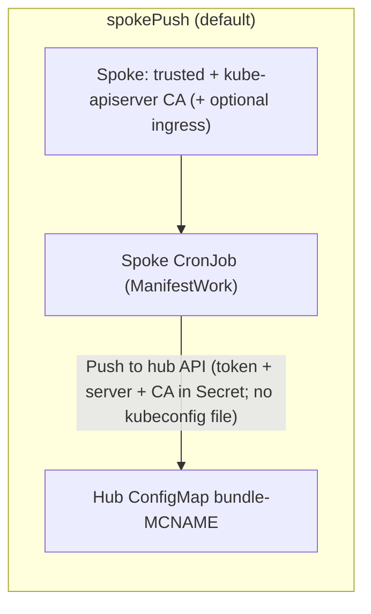
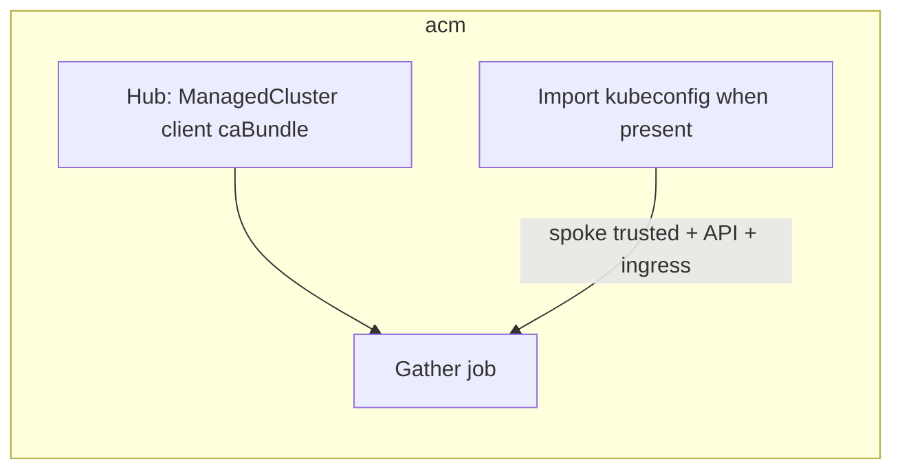
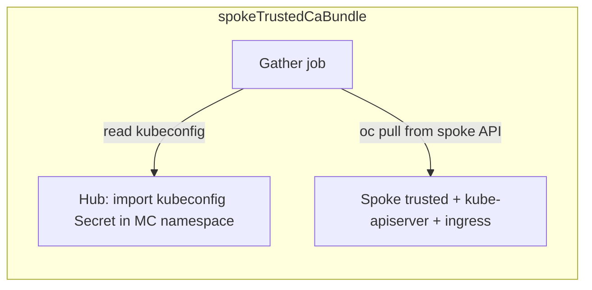
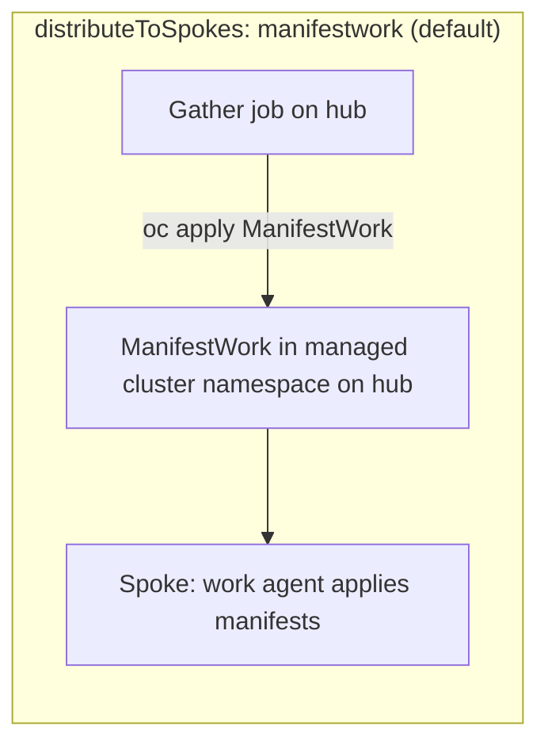
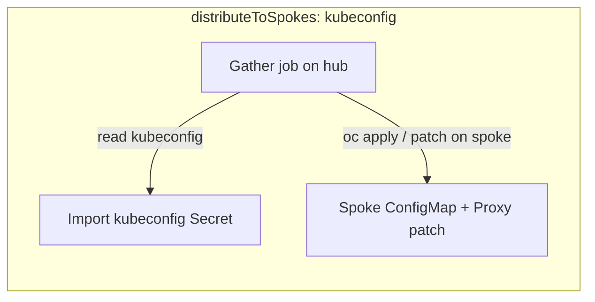
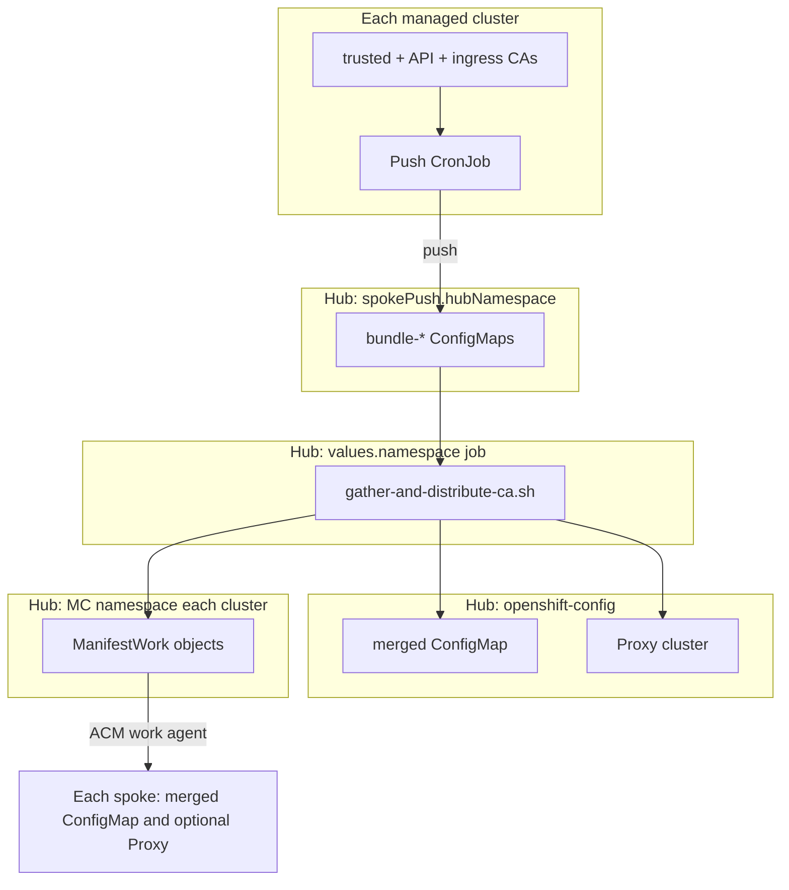

# vp-manage-proxy-cluster-ca

 

Hub-side chart for OpenShift. With ACM (default), distributes a merged CA bundle to ManagedClusters via ManifestWork (spoke push + hub ingress, then gather job), including Proxy/cluster trustedCA on spokes unless turned off. Set acm.enabled false for a standalone cluster: merge hub trusted-ca only and manage local Proxy/ConfigMap without ACM APIs. ACM Policy + PlacementBinding (when acm.enabled) add Governance visibility with default inform remediation; they do not gate rollout. Override policy.* or excludeManagedClusters as needed.

**At a glance:** With **`acm.enabled: true`** (default), **ManifestWork** rolls the merged CA **ConfigMap** and **`Proxy/cluster` `trustedCA`** to spokes; **ACM Policy + PlacementBinding** add **GRC** compliance and **cluster violation** detail using default **`policy.remediationAction: inform`**. With **`acm.enabled: false`**, the job only merges **hub** trust material and updates **local** **`openshift-config`** **ConfigMap** + **`Proxy`** (no **ManagedCluster** / **ManifestWork** / Policy). Override **policy.*** or **excludeManagedClusters** as needed. See **Policy visibility in ACM** and **Hub-only (`acm.enabled: false`)** under Overview.

## Overview

> **GitOps — `ManagedClusterSetBinding` / `global`:** This chart defaults to **`policy.createManagedClusterSetBindings: false`**, so it does **not** render **`ManagedClusterSetBinding`**. Argo CD often shows **`global` “disappearing”** when **two Applications** (or ACM plus this chart) both try to own the same **`ManagedClusterSetBinding`** name in the same namespace: sync replaces or prunes the object. **Pick one writer:** keep **`ManagedClusterSetBinding`** for **`global`** (and your other **`policy.placement.clusterSets`**) in a **platform / ACM** Application, and leave this chart to **`Placement`**, **`Policy`**, and **`PlacementBinding`** only. Set **`policy.createManagedClusterSetBindings: true`** only on hubs where **nothing else** creates those bindings. Chart-created bindings still carry **`helm.sh/resource-policy: keep`** when enabled.

> **GitOps — Argo CD and hub `Policy.status`:** The governance propagator updates **`Policy.status`** on the hub after sync. Argo CD often reports **OutOfSync** if the rendered manifest omits that subtree. On the **Application** that installs this chart, add **`ignoreDifferences`** for **`policy.open-cluster-management.io` / `Policy`** with **`jqPathExpressions: ['.status']`** (or equivalent) so Argo compares only **spec** while ACM owns **status**. This does not change spoke behavior.

### Hub-only (`acm.enabled: false`)

Use on **standalone OpenShift** (no multicluster engine / no **ManagedCluster** API). The gather job **does not** list clusters, deploy **spoke-push** agents, create **ManifestWork**, or render **Policy** / **Placement**. It **only** reads **`openshift-config-managed/trusted-ca-bundle`**, **`kube-apiserver-server-ca`** (API), optional **`router-ca`** when **`includeIngressCA`**, **`additionalCaBundles`**, de-duplicates, then applies **`configMapName`** and patches **`Proxy/cluster`** on **this** cluster. Values such as **`managedClusterCaSource`** and **`distributeToSpokes`** are ignored for multicluster behavior while **`acm.enabled`** is **false** (the script logs once if **`spokePush`** was selected).

### Injecting extra CA material (`additionalCaBundles`)

Use **`additionalCaBundles`** in **`values.yaml`** when you need PEMs in the **cluster-wide Proxy bundle** that are **not** already picked up from the normal inputs (hub and spoke **`trusted-ca-bundle`**, optional ingress CA, and **`managedClusterCaSource`**). Each entry is a **YAML string**; use a **block scalar** (`|`) so PEM line breaks stay valid. The gather job **merges** those PEMs with the rest of the material, then **de-duplicates by certificate fingerprint** before writing **`configMapName`** / **`ca-bundle.crt`**.

**Relation to platform “injection”:** If another mechanism already puts your CA into the platform trust store (for example **Cluster Network Operator** **`inject-trusted-cabundle`** on a `ConfigMap`, or a **Vault / CSI** chart that feeds **`trusted-ca-bundle`**), those certs are usually **already present** in **`openshift-config-managed/trusted-ca-bundle`** and are **included automatically**—you often **do not** need **`additionalCaBundles`**. Use **`additionalCaBundles`** for CAs that are **outside** that path (for example a private issuer only published in Git, or Vault serving a chain that never appears on the nodes’ default bundle). See the commented example PEM block in **`values.yaml`**.

### Distribution to managed clusters (defaults)

The default path is **`distributeToSpokes: manifestwork`**: the gather **CronJob/Job** lists hub **ManagedCluster** objects (respecting **`managedClusterLabelSelector`** and **`excludeManagedClusters`**), then applies **ManifestWork** in each cluster namespace so the **work agent** reconciles the merged **ConfigMap** and (unless disabled) **`Proxy/cluster` `trustedCA`**. That is the chart’s primary “distribute to spokes” behavior. **ManifestWork for the managed cluster name `local-cluster` is skipped** because the hub copy is already applied in-cluster.

### Policy visibility in ACM (recommended)

Requires **`acm.enabled: true`** (Policy templates are not rendered when **`acm.enabled`** is **false**).

Keep **`policy.enabled: true`** (the default) when you want **ACM Governance / GRC** visibility into CA distribution outcomes: the hub **Policy** and **replicated policies** on each managed cluster surface **compliance** (and **cluster violations** / NonCompliant detail, including **`policy.configurationCustomMessage`**) for **`Proxy/cluster`** **`spec.trustedCA.name`** matching **`configMapName`**. Default **`policy.remediationAction: inform`** means the policy engine **evaluates and reports** only—**ManifestWork** (by default) **applies** **`Proxy`** on spokes, so you get populated GRC columns **without** two controllers reconciling the same **`Proxy`**. Set **`policy.remediationAction: enforce`** only when **`manifestWork.patchClusterProxy`** is **false** or you intentionally want the policy controller to remediate **`Proxy`**.

If **Placement** selects **zero** clusters, hub **Policy** compliance may stay empty while **ManifestWork** has still delivered the bundle—use **ManifestWork** / spoke **ConfigMap** as the rollout source of truth, and fix **Placement** + **`ManagedClusterSetBinding`** (see the **GitOps** callout) so **Policy** status populates for full visibility.

Helm chart for the **hub** cluster (OpenShift + ACM). It periodically aggregates PEM material from:

- the hub: `ConfigMap/openshift-config-managed/trusted-ca-bundle` (`ca-bundle.crt`), **`ConfigMap/openshift-config-managed/kube-apiserver-server-ca`** (API / apiserver TLS bundle, with **`kube-root-ca.crt`** in `openshift-config` or in-cluster **service account CA** as fallbacks), and when **`includeIngressCA`**: ingress **`router-ca`**;
- each selected **ManagedCluster**:
  - **`managedClusterCaSource: spokePush`** (default): a **ManifestWork** deploys a CronJob on each spoke that merges **`trusted-ca-bundle`**, **`kube-apiserver-server-ca`** (or the pod **service account CA** if that ConfigMap is absent), **`router-ca`** when **`includeIngressCA`**, then **writes** `ConfigMap/bundle-<cluster>` into **`spokePush.hubNamespace`** on the hub (**no kubeconfig file** on the spoke). The gather job **reads every** `bundle-*` ConfigMap there.
  - **`acm`**: always **`ManagedCluster.spec.managedClusterClientConfigs[].caBundle`** (API client trust). When an **import kubeconfig** Secret exists in the managed-cluster namespace, the job also pulls that spoke’s **`trusted-ca-bundle`**, **kube-apiserver-server-ca** (API), and optional **`router-ca`**—same as **`spokeTrustedCaBundle`** for those fetches.
  - **`spokeTrustedCaBundle`**: per spoke, **`trusted-ca-bundle`**, **kube-apiserver-server-ca** (API), and optional **`router-ca`**, via ACM import kubeconfig ([opp-policy-chart](https://github.com/validatedpatterns/opp-policy-chart)-style).

Certificates are **split and de-duplicated** by SHA-256 certificate fingerprint, then written to a single `ConfigMap` (`ca-bundle.crt`) in `openshift-config`. On the hub the job applies the ConfigMap and patches **`Proxy/cluster`**. On spokes (defaults) it applies one **`ManifestWork`** per cluster (ConfigMap, then **`Proxy` `trustedCA`** in the same manifest list when **`manifestWork.patchClusterProxy`** is true) so ordering is deterministic — still **no kubeconfig** in the chart or job for rollout. Set `distributeToSpokes: kubeconfig` to push via import secrets instead.

**`policy.enabled`** (default **true**) adds ACM **Policy** + **PlacementBinding**—**leave on** for GRC compliance and violation columns unless another team owns the same **Proxy** **ConfigurationPolicy**. Default **`policy.remediationAction: inform`** avoids competing with **ManifestWork** on **`Proxy`**. **`policy.createPlacement`** (default **true**) renders **`Placement`** for **`policy.placement.clusterSets`** (default **`global`**). **`policy.createManagedClusterSetBindings`** defaults to **`false`**—see the **GitOps** callout; ensure **`global`** is still bound in that workspace so **Placement** (and **Policy** status) stay healthy. Set **`policy.createPlacement: false`** only if you supply your own **Placement** + bindings. **Placement troubleshooting** (for example **`NoIntersection`**): same-namespace **`ManagedClusterSetBinding`** as **Placement**, **`policy.placement.clusterSets`** membership, and workspace **`policy.placementRef.namespace`** / **`policy.hubNamespace`**—see the **Hub cluster group — `namespaces`** table later in this document.

Defaults (**`spokePush`** + **`manifestwork`** + **`manifestWork.patchClusterProxy: true`**) avoid **kubeconfig files** in Git or in the gather pod for rollout; **`spokeTrustedCaBundle`** or **`distributeToSpokes: kubeconfig`** still read ACM import **kubeconfig Secrets on the hub** at runtime.

## Push and pull configuration options

Configuration splits into two **independent** axes:

1. **`managedClusterCaSource`** — how the hub **gather job** obtains per-cluster trust material before merge/de-duplication.
2. **`distributeToSpokes`** — how the merged bundle (and optional `Proxy` patch) is **applied on each spoke** after the hub updates its own `ConfigMap`/`Proxy`.

The hub always reads **hub-local** `openshift-config-managed/trusted-ca-bundle`, **kube-apiserver-server-ca** (API), and optional **ingress** with in-cluster credentials. **`includeIngressCA`** gates **router** ingress PEMs only; **API** CAs from the ConfigMaps above are merged whenever present. On spokes, **`includeIngressCA`** is honored wherever the job can reach the spoke API (**`spokePush`** script, **`spokeTrustedCaBundle`**, and **`acm`** when import kubeconfig is available).

### How each `managedClusterCaSource` works







### How each `distributeToSpokes` mode works

After the merge, the job updates the hub, then for every selected `ManagedCluster`:





### End-to-end: recommended default

Hub gather periodically merges sources, writes `configMapName` in `targetNamespace`, patches hub `Proxy`, then rolls out to spokes **without** storing kubeconfigs in the chart or Git:



### Combination matrix

| `managedClusterCaSource` | Spoke trust material | Hub gather uses import kubeconfig? | Notes |
|-------------------------|----------------------|-----------------------------------|--------|
| **`spokePush`** | Per spoke: **`trusted-ca-bundle`**, **`kube-apiserver-server-ca`** (or SA CA), **`router-ca`** if **`includeIngressCA`**, pushed to **`spokePush.hubNamespace`** | **No** (reads `bundle-*` on hub) | Spokes use short-lived hub token + API URL + hub CA in a Secret; **`spokePush.hubApiServer`** if spokes cannot use the gather pod’s API URL. |
| **`acm`** | **`ManagedCluster`** **client caBundle**; plus **trusted + kube-apiserver + ingress** from spoke when **import kubeconfig** exists | **Only** for the optional spoke pulls | Without import Secret, only hub-side **client caBundle** is merged for that cluster (no per-spoke ingress). |
| **`spokeTrustedCaBundle`** | **`trusted-ca-bundle`**, **kube-apiserver-server-ca**, **`router-ca`** if **`includeIngressCA`** | **Yes** | Same import Secret pattern as [opp-policy-chart](https://github.com/validatedpatterns/opp-policy-chart). |

| `distributeToSpokes` | Rollout mechanism | Hub job uses import kubeconfig? |
|------------------------|-------------------|--------------------------------|
| **`manifestwork`** | `ManifestWork` in each managed-cluster namespace; work agent applies | **No** |
| **`kubeconfig`** | `oc` against each spoke API using import kubeconfig | **Yes** |

So **kubeconfig on the hub** is required when **either** axis is set to the kubeconfig/import path: `managedClusterCaSource: spokeTrustedCaBundle` **or** `distributeToSpokes: kubeconfig` (or both).

### Values examples

**Default (no kubeconfig for gather or rollout):** push bundles from spokes, distribute with `ManifestWork`.

```yaml
managedClusterCaSource: spokePush
distributeToSpokes: manifestwork
spokePush:
  hubNamespace: vp-proxy-ca-bundles
  spokeNamespace: vp-proxy-ca-sync
  # hubApiServer: "https://api.hub.example.com:6443"   # if spokes cannot reach in-cluster API URL
```

**ACM API trust only, ManifestWork rollout** (lightweight; not a full spoke PKI mirror):

```yaml
managedClusterCaSource: acm
distributeToSpokes: manifestwork
includeIngressCA: true   # hub + spoke ingress when import kubeconfig exists for each ManagedCluster
```

**Pull full spoke bundles with import kubeconfig, rollout via work agent** (no kubeconfig for rollout step):

```yaml
managedClusterCaSource: spokeTrustedCaBundle
distributeToSpokes: manifestwork
includeIngressCA: true
```

**Push bundles from spokes, but apply merged bundle with `oc` + import kubeconfig** (e.g. environments where ManifestWork rollout is not desired):

```yaml
managedClusterCaSource: spokePush
distributeToSpokes: kubeconfig
```

**All kubeconfig-driven gather and rollout** (closest to classic opp-policy-style `oc` against each spoke):

```yaml
managedClusterCaSource: spokeTrustedCaBundle
distributeToSpokes: kubeconfig
includeIngressCA: true
```

Tune **`managedClusterLabelSelector`** and **`excludeManagedClusters`** in all cases so the job only touches intended clusters.

## Install

Target the hub API (in-cluster or kubeconfig). Install into a hub namespace that can run batch jobs (defaults to `openshift-config`, same as opp-policy’s extractor).

Tune **`managedClusterLabelSelector`** so only clusters in your pattern (or ClusterSet labels) are included. **`excludeManagedClusters`** is empty by default so every ManagedCluster is included; set space-separated names (e.g. `local-cluster`) only if you must skip rollout for specific clusters.

### Validated Patterns cluster groups (applications and namespaces)

This chart is **hub-scoped** for GitOps: OpenShift GitOps should deploy it from the **hub** cluster group values file only (for example `values-hub.yaml`, depending on `main.clusterGroupName` in `values-global.yaml`). Spoke **push** workloads (`spokePush` CronJob, RBAC, and namespace **`spokePush.spokeNamespace`**) are applied by the hub job via **ManifestWork**, not by a second copy of this chart on managed clusters. See [ClusterGroup in values files](https://validatedpatterns.io/learn/clustergroup-in-values-files/) for how `applications`, `namespaces`, `projects`, and `managedClusterGroups` fit together.

**Hub cluster group — `applications`**

Add one Helm application whose `path` is the chart directory inside your pattern repository (adjust to match your layout). Set **`namespace`** to the Argo CD **destination** namespace for the release; it should match **`namespace`** in this chart’s values (default **`openshift-config`**) so the CronJob, Job, RBAC, and script `ConfigMap` land where the chart expects. **`project`** must be an OpenShift GitOps `AppProject` that allows that destination (patterns often use a project named `hub` or similar).

```yaml
# Example fragment for values-hub.yaml (keys vary slightly by pattern; align with your repository’s clustergroup schema)
applications:
  vp-manage-proxy-cluster-ca:
    name: vp-manage-proxy-cluster-ca
    namespace: openshift-config
    # <chart location information>
    # optional: extraValueFiles:
    #   - /values-proxy-ca-hub.yaml
```

**Hub cluster group — `namespaces`**

| Namespace | Typical action in cluster group | Why |
|-----------|----------------------------------|-----|
| **`openshift-config`** | Usually **omit** from “create” lists (platform namespace already exists). Ensure your GitOps **AppProject** allows deploying into it if that is the chart `namespace`. | Holds the gather CronJob/Job, merged `ConfigMap` (`configMapName`), and hub `Proxy` patch. |
| **`spokePush.hubNamespace`** (default **`vp-proxy-ca-bundles`**) | **Optional** entry: the chart creates a `Namespace` object for it, but some patterns predeclare namespaces for labels, quotas, or project allowlists. | Per-cluster **`bundle-*`** ConfigMaps and hub-side spoke-push Secrets. |
| **`policy.placementRef.namespace`** or **`policy.hubNamespace`** (default **`open-cluster-management`**) | Usually **omit** if your hub cluster group already installs ACM (that subscription creates the namespace). When **`placementRef.namespace`** is empty, **`hubNamespace`** is the ACM workspace for **Policy**, **PlacementBinding**, and **Placement** (and optional chart-owned **ManagedClusterSetBinding**). | **`ManagedClusterSetBinding`** for **`policy.placement.clusterSets`** must exist in the **same** namespace as **Placement** (often owned by a **platform** app when **`policy.createManagedClusterSetBindings`** is **false**); otherwise **Placement** shows **`NoIntersection`**. |

**Managed cluster groups (spokes) — `applications` and `namespaces`**

| Item | Action |
|------|--------|
| **`applications`** | **Do not** add this chart to spoke `applications`. Spokes receive the push agent and namespace via **ManifestWork** from the hub. |
| **`namespaces`** | **Optional**: include **`spokePush.spokeNamespace`** (default **`vp-proxy-ca-sync`**) if your pattern pre-creates spoke namespaces or enforces allowlists—otherwise the ManifestWork still creates/uses that namespace when the hub job reconciles. |

If you use **`distributeToSpokes: kubeconfig`** or **`managedClusterCaSource: spokeTrustedCaBundle`**, no extra Validated Patterns **application** is required on spokes; the gather job still runs on the hub and uses ACM import **Secrets** in each managed-cluster namespace on the hub.

## Values highlights

| Value | Purpose |
|--------|---------|
| `configMapName` | ConfigMap in `openshift-config` holding `ca-bundle.crt` (default avoids clashing with `cluster-proxy-ca-bundle` if used elsewhere). |
| `managedClusterLabelSelector` | Passed to `oc get managedclusters --selector=…` (empty = all). |
| `excludeManagedClusters` | Space-separated names to skip (default empty = all clusters get bundle + Proxy ManifestWork). |
| `managedClusterCaSource` | `spokePush` (default): per-spoke trusted + API + optional ingress pushed to hub. `acm`: **client caBundle** plus spoke pulls when import kubeconfig exists. `spokeTrustedCaBundle`: pull trusted + API + ingress via kubeconfig. Set `spokePush.hubApiServer` if spokes cannot use the gather pod’s API URL. |
| `spokePush.*` | Hub namespace, spoke sync namespace, CronJob schedule, token duration, optional hub API override (`hubApiServer`). |
| `distributeToSpokes` | `manifestwork` (default): `ManifestWork` in each cluster namespace. `kubeconfig`: apply/patch via import kubeconfig. |
| `manifestWork.patchClusterProxy` | Adds `Proxy/cluster` `trustedCA` to the **same** spoke ManifestWork as the bundle (default true; set false if Policy or another process owns Proxy on spokes). |
| `additionalCaBundles` | **Inject** extra PEMs into the merged bundle (see **Injecting extra CA material** above); merged then fingerprint de-duplicated. |
| `includeIngressCA` | When true, merge **`router-ca`** on hub and on spokes where reachable. **API** CAs (**`kube-apiserver-server-ca`**, etc.) are merged regardless of this flag. |
| `cronJob` / `syncJob` | Scheduled refresh vs one-shot post-install/upgrade Job. |
| `acm.enabled` | **true** (default): multicluster + Policy. **false**: hub-only **ConfigMap** + **Proxy** on this cluster; no ACM CRs from this chart. |
| `policy` | When **`acm.enabled`**: default **enabled** — **Policy** + **PlacementBinding** for **GRC** vs **`configMapName`**. Default **`remediationAction: inform`**; **`configurationCustomMessage`** for violation text. **`createManagedClusterSetBindings`** defaults **false** (GitOps). |

## References

- CA extraction approach: [opp-policy-chart](https://github.com/validatedpatterns/opp-policy-chart) (`trusted-ca-bundle`, spoke kubeconfig pattern, `Proxy` trusted CA wiring).
- OpenShift proxy: [Configuring the cluster-wide proxy](https://docs.openshift.com/container-platform/latest/networking/configuring-a-custom-pki.html#nw-proxy-configure-cluster_configuring-a-custom-pki).

## Notable changes

- **ACM Policy name**: the governance webhook requires **`len(policy namespace) + len(policy name) <= 62`**. The chart default is **`vpca-<truncated Helm release name>`** when **`policy.name`** is empty. Remove stale **`Policy`** / **`PlacementBinding`** with the old long name after upgrade if needed.
- **`policy.createManagedClusterSetBindings`** defaults to **`false`**: manage **`ManagedClusterSetBinding/global`** in a single platform Argo Application; set **`true`** only when this chart should own those objects.
- **`policy.remediationAction`** defaults to **`inform`**: GRC shows compliance and violation detail while **ManifestWork** remains the default applier for spoke **`Proxy`**; use **`enforce`** only when you are not double-writing **`Proxy`** with **`manifestWork.patchClusterProxy: true`**.
- **`acm.enabled`**: set **`false`** for standalone hubs to manage **only** the local **Proxy** bundle without **ManagedCluster** / **ManifestWork** / Governance objects from this chart.
- **Gather inputs**: hub and spokes (per **`managedClusterCaSource`**) now always attempt **`kube-apiserver-server-ca`** / **`kube-root-ca.crt`** (API) in addition to **`trusted-ca-bundle`**; **`includeIngressCA`** still controls **`router-ca`** ingress PEMs.

## Values

| Key | Type | Default | Description |
|-----|------|---------|-------------|
| acm.enabled | bool | `true` | When false, hub-only proxy CA (no multicluster); policy.* and spokePush hub assets are not applied. |
| additionalCaBundles | list | `[]` | PEM strings merged into the gather bundle before fingerprint de-duplication; see README Overview "Injecting extra CA material". |
| clusterReadinessMaxAttempts | int | `150` |  |
| clusterReadinessSleepSeconds | int | `30` |  |
| configMapName | string | `"vp-pattern-proxy-ca-bundle"` |  |
| cronJob.concurrencyPolicy | string | `"Forbid"` |  |
| cronJob.enabled | bool | `true` |  |
| cronJob.failedJobsHistoryLimit | int | `3` |  |
| cronJob.schedule | string | `"*/10 * * * *"` |  |
| cronJob.successfulJobsHistoryLimit | int | `1` |  |
| cronJob.suspend | bool | `false` |  |
| distributeToSpokes | string | `"manifestwork"` |  |
| excludeManagedClusters | string | `""` |  |
| fullnameOverride | string | `""` |  |
| image.pullPolicy | string | `"IfNotPresent"` |  |
| image.repository | string | `"quay.io/validatedpatterns/imperative-container"` |  |
| image.tag | string | `"latest"` |  |
| includeIngressCA | bool | `true` | Include default ingress `router-ca` PEMs in the merge when hub/spoke API access allows (API CAs are merged regardless). |
| managedClusterCaSource | string | `"spokePush"` |  |
| managedClusterLabelSelector | string | `""` |  |
| manifestWork.nameOverride | string | `""` |  |
| manifestWork.patchClusterProxy | bool | `true` |  |
| manifestWork.proxyNameOverride | string | `""` |  |
| nameOverride | string | `""` |  |
| namespace | string | `"openshift-config"` |  |
| podSecurityContext.runAsGroup | int | `0` |  |
| podSecurityContext.runAsNonRoot | bool | `true` |  |
| podSecurityContext.runAsUser | int | `1000690001` |  |
| podSecurityContext.seccompProfile.type | string | `"RuntimeDefault"` |  |
| policy.configurationCustomMessage | string | `"Proxy/cluster spec.trustedCA.name must match the merged CA bundle ConfigMap (see chart values.configMapName). When NonCompliant, fix ManifestWork rollout or gather output; this policy is inform-only by default so it does not apply Proxy."` | NonCompliant message in GRC / cluster violations detail (ConfigurationPolicy spec.customMessage). |
| policy.createManagedClusterSetBindings | bool | `false` | When false (default), chart does not render ManagedClusterSetBinding; bind policy.placement.clusterSets in the policy workspace via a platform GitOps app. Set true if this chart should own those bindings. |
| policy.createPlacement | bool | `true` |  |
| policy.description | string | `"Ensures OpenShift Proxy/cluster spec.trustedCA.name matches the merged cluster-wide CA bundle ConfigMap (values.configMapName). Default remediation is inform so GRC shows compliance and cluster violations without competing with this chart's ManifestWork on the same Proxy object."` | Shown in ACM Governance as policy description (annotation policy.open-cluster-management.io/description). |
| policy.enabled | bool | `true` | Enable ACM Policy + PlacementBinding for Governance/GRC console visibility of Proxy trustedCA vs configMapName (does not gate ManifestWork). |
| policy.hubNamespace | string | `"open-cluster-management"` |  |
| policy.name | string | `""` | Hub Policy metadata.name; empty uses vpca-<truncated Release.Name> so len(namespace)+len(name)<=62 (ACM webhook). |
| policy.placement.clusterSets[0] | string | `"global"` |  |
| policy.placementRef.name | string | `"vp-proxy-ca"` |  |
| policy.placementRef.namespace | string | `""` |  |
| policy.remediationAction | string | `"inform"` | inform (default): report compliance and violations in ACM; ManifestWork applies Proxy. enforce: policy controller also remediates Proxy—avoid with manifestWork.patchClusterProxy true unless you accept two writers. |
| resources.limits.cpu | string | `"1"` |  |
| resources.limits.memory | string | `"1Gi"` |  |
| resources.requests.cpu | string | `"200m"` |  |
| resources.requests.memory | string | `"512Mi"` |  |
| securityContext.allowPrivilegeEscalation | bool | `false` |  |
| securityContext.capabilities.drop[0] | string | `"ALL"` |  |
| serviceAccount.create | bool | `true` |  |
| serviceAccount.name | string | `""` |  |
| spokePush.hubApiServer | string | `""` |  |
| spokePush.hubNamespace | string | `"vp-proxy-ca-bundles"` |  |
| spokePush.manifestWorkNameOverride | string | `""` |  |
| spokePush.schedule | string | `"*/10 * * * *"` |  |
| spokePush.spokeNamespace | string | `"vp-proxy-ca-sync"` |  |
| spokePush.tokenDuration | string | `"720h"` |  |
| syncJob.enabled | bool | `true` |  |
| targetNamespace | string | `"openshift-config"` |  |
| waitForManagedClusterAvailable | bool | `true` |  |

----------------------------------------------
Autogenerated from chart metadata using [helm-docs v1.14.2](https://github.com/norwoodj/helm-docs/releases/v1.14.2)
